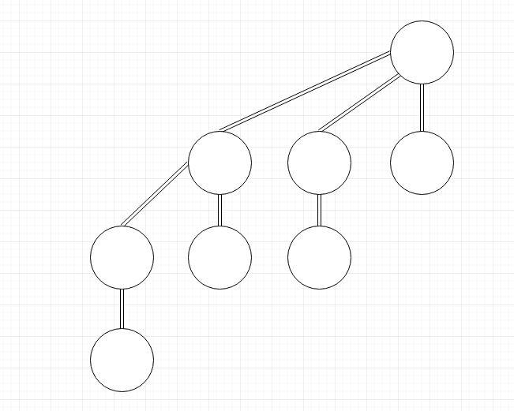
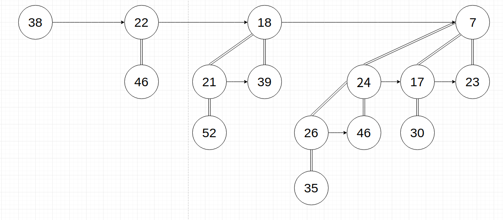
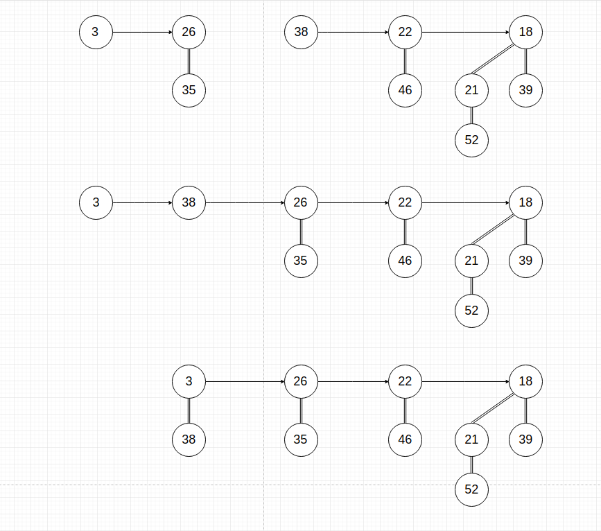

# CS5010 Algorithm Assignment 2

## *Q1 MultiColor Sort*

**You are given an array A containing 3 colors Red, Green and Blue. Write a linear time algorithm to sort this array. Please note you cannot use any external memory for  sorting. The  ordering  of  colors  should  be  Red  followed  by  Green  and  Blue  in order.**

**For example: A = [“Green”, “Blue”, “Blue”, “Red”, “Green”]**

**Output should be: [“Red”, “Green”, “Green” ,“Blue”, “Blue”]**

---

### *Answer*

+ There are only three kinds of colors. Color Red must start from 0, and the array will end in Blue, all the Green are in the middle.

+ Form three indexes here. First index *head* indicates the Red color, second index *middle* indicates the Green color, thrid index *tail* indicates the Blue color.

+ *head* starts at 0, *tail* starts at n-1. We only need to move the *middle* index to check the color. *middle* starts at 0.

+ Move *head* to next index if current color is Red. Move *tail* to former index if current color is Blue.

+ Then start to move *middle* to next index, check the color at *middle*: If the color is Red, switch the colors at *head* and *middle*, plus 1 to *head* and *middle*; If the color is Blue, switch the colors at *tail* and *middle*, plus 1 to *middle*, minus 1 to *tail*.

+ Stop moving the *middle* when *middle* equals *tail*.

Python Code of the answer listed below:

    def swap(arr, index1, index2):
        tmp = arr[index1]
        arr[index1] = arr[index2]
        arr[index2] = tmp

    def sort_color(arr):
        head = middle = 0
        tail = len(arr) - 1
        while middle < tail:
            if arr[middle] == 'Red':
                swap(arr, head, middle)
                head += 1
                middle += 1
            elif arr[middle] == 'Green':
                middle += 1
            else:
                swap(arr, tail, middle)
                tail -= 1
                middle += 1

The code modify the array in-place, does not allocate more memory.

The algorithm has a time complexity of O(n).

## *Q2 Streaming Heaps*

**Binary  heaps  in  general  allow  for  constant  time  findMin  and  logarithmic  time deleteMin and insert operations. However one of the drawbacks of binary heaps is merging  two  heaps  together  which  takes  linear  time.  Often  in  real  world  while working  with  streaming  data,  you  have  a  stream  of  prioritized  data  clustered together  and  having  a  fast  way  to  merge  two  heaps  together  would  be  really critical.**

**Design a data structure that builds upon the heap design and allows for faster than linear  time  merge  operation.  You  can  take  some  penalty  in  other  operations  but none of the other operations can be slower than logarithmic time.**

### *Answer*

1. Form both heaps to binomial heaps. Binomial heap is based on binomial tree,  binomial tree Bk has following attributes:

    + Has 2k nodes.
    + The height of the tree is k
    + Bk has Cki nodes at depth i.
    + The degree of the root is k

    The graph is a B3 binomial tree.

    

2. The binomial heap is a collections of binomial tree, arrange them in ascending order by degree of the root. Each binomial tree has the min-heap's characteristics. Meanwhile there can not be two or more binomial trees with same degree in a binomial heap.

    The graph is a example.

    

        class node {
            int key # The value of the node.
            int degree # The degree of the current tree.
            node child # First child.
            node sibling # The same level/right node.
            node parent # The parent node.
        }

    Note that the sibling node can provide  functions like linked list.
3. Then we check the merge option of 2 binomial heaps.

    + Rearrage the root linked list by its degree in ascending order.

    + Then start to merge the binomial trees with same degree. Merge has different situations:

        + If current node and the next node has different degrees, do nothing at the moment, keep moving to the next node.

        + If current node and the next 2 nodes has the same degrees, do nothing at th moment,  so that we can operate on last two nodes with same degree.

        + If current node has the same degree of the next node, but different from the next 2 node, and the value of current node is less than the next node, make the next node to be current node's child.

        + Same situation as the thrid one, but the value of current node is bigger than the next node, make current node to be next node's child.

    The graph is a example.

    
        
        def merge(heap1, heap2):
            # Merge two linked list
            if not heap1:
                return heap2
            elif not heap2:
                return heap1
            rst = new Node()
            if heap1.degree < heap2.degree:
                rst = heap1
                rst.next = merge(heap1.next,heap2)    
            else:
                rst = heap2
                rst.next = merge(heap1,heap2.next)

            return rst

        def link(child, heap):
            # Merget two root
            child.parent = heap
            child.next = heap.child
            heap.child = child
            heap.degre += 1

        def union(heap1, heap2):
            # Merge all
            heap = Merge(heap1, heap2)
            if not heap:
                return None
            pre_node = None
            current_node = heap
            next_node = heap.next

            while next_node:
                if (current_node.degree != next_node.degree || next_node.next != None) and next_node.degree == next_node.next.degree:
                    pre_node = current_node
                    current_node = next_node
                elif current_node.val <= next_node.val:
                    current_node.next = next_node.next
                    next_node.parent = current_node
                    link(next_node, current_node)
                else:
                    if not pre_node:
                        heap = next_node
                    else:
                        pre_node.next = next_node
                    link(x, next_node)
                    current_node = next_node
                next_node = current_node.next
            return heap
    
    + The time complexity of the merge operation is O(log n), since we only compare the root nodes of the binomial heap.

    + The insert is O(log n), findMin is also O(log n), because min value is in the root linked list.

## *Q3 Hashing*

**You are given a hash function h(x) as follows:**

**h(x) = (11*x) mod 13**

**Use this hash function to:**

**(A) Compute the hash values for keys: 33, 43, 44, 55, 59, 69, 75, 98  - (5 Pts.)**

**(B) Insert the following keys in a hash table of size = 13. Use chaining technique to handle collision. Assume empty hash table to begin with. Show the final state of hash table after inserting the keys in following order: 33, 69, 75, 44, 59, 43, 98, 55 - (10 Pts.)**

**(C)Insert the following keys in a hash table of size = 13. Use open addressing with linear  probing  strategy  to  handle  collision. Assume  empty  hash  table  to  begin with.  Show  the  final  state  of  hash  table  after  inserting  the  keys  in  following order: 33, 69, 75, 44, 59, 43, 98, 55 - (10 Pts.)**

**(D)Insert the following keys in a hash table of size = 13. Use open addressing with Quadratic  probing  strategy  to  handle  collision.  Assume  empty  hash  table  to begin  with.  Show  the  final  state  of  hash  table  after  inserting  the  keys  in following order: 33, 69, 75, 44, 59, 43, 98, 55 - (10 Pts.)**

### *Answer*

(A) 

+ h(33) = 12
+ h(43) = 5
+ h(55) = 7
+ h(59) = 12
+ h(69) = 5
+ h(75) = 6
+ h(98) = 12

(B) Insert 33, 69, 75, 44, 59, 43, 98, 55

0 

1

2

3 **44**

4

5 **69 -> 43**

6 **75**

7 **55**

8

9

10

11

12 **33 -> 59 -> 98**

(C) Insert 33, 69, 75, 44, 59, 43, 98, 55

0 **59**

1 **98**

2

3 **44**

4

5 **69**

6 **75**

7 **43**

8 **55**

9

10

11

12 **33**

(D) Insert 33, 69, 75, 44, 59, 43, 98, 55

0  **59**

1 

2

3 **44**

4

5 **69**

6 **75**

7 **55**

8 **98**

9 **43**

10

11

12 **33**